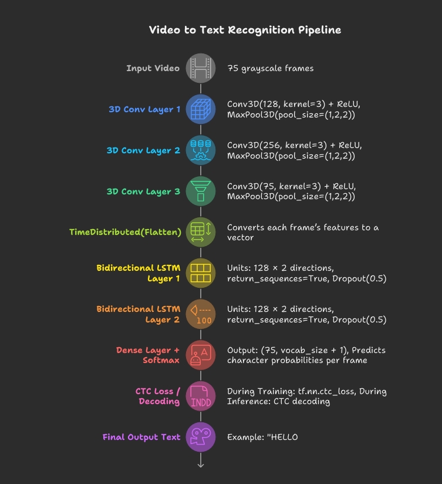

# LipSync 👄🧠

**LipSync** is a web-based AI application that reads and interprets human lip movements from video using a deep learning model. Built with a modern, animated frontend and a powerful backend, it delivers an interactive and intelligent lip-reading experience.

---

## 🔍 What is LipSync?

LipSync is a real-time **lip-reading web app** that uses a custom-trained AI model to detect and interpret speech based solely on lip movements. It's useful for silent communication, accessibility enhancement, and augmenting voice recognition systems.

---

## 🌐 Application Flow

1. **Landing Page**  
   ➤ Welcome screen with smooth animations using GSAP.

   

2. **Select Options**  
   ➤ Choose between webcam input or uploading a pre-recorded video.
   
    

3. **Upload Video**  
   ➤ Upload your video file containing lip movement.
   

4. **Wait for Processing**  
   ➤ The backend processes the video using a TensorFlow/Keras model.
   

5. **See Output**  
   ➤ View the predicted spoken words based on the lip movements.


---

## 💻 Tech Stack

### Frontend
- **React** – Interactive user interface
- **GSAP** – Smooth animations and transitions
- **Tailwind CSS** or custom CSS – For styling

### Backend
- **Python** (Flask or FastAPI) – API to process videos
- **TensorFlow** & **Keras** – Model training and inference
- **NumPy** – Numerical processing and frame handling
- **OpenCV** – handling vedio and images calculation

### Dataset
- **grid speaking data along 10000** used to train the model

---

## 🧠 Model Overview

- **Model Type**: CNN + LSTM/GRU (for visual sequence processing)
- **Input**: Mouth region frames from video
- **Output**: Predicted text/speech


---

## 🚀 Features

- 🎥 Lip-reading from webcam or uploaded video
- ⚡ Animated and intuitive UI with GSAP
- 🧠 Trained AI model on 1000 videos
- 🔧 Modular structure (easy to expand or customize)

---

## 📦 Getting Started

### 1. Clone the Repository
```bash
git clone https://github.com/your-username/LipSync.git
cd LipSync


## 🚀 Backend
cd backend
pip install -r requirements.txt
python app.py

## 🚀Frontend
cd frontend
npm install
npm run dev


# React + Vite

This template provides a minimal setup to get React working in Vite with HMR and some ESLint rules.

Currently, two official plugins are available:

- [@vitejs/plugin-react](https://github.com/vitejs/vite-plugin-react/blob/main/packages/plugin-react) uses [Babel](https://babeljs.io/) for Fast Refresh
- [@vitejs/plugin-react-swc](https://github.com/vitejs/vite-plugin-react/blob/main/packages/plugin-react-swc) uses [SWC](https://swc.rs/) for Fast Refresh

## Expanding the ESLint configuration

If you are developing a production application, we recommend using TypeScript with type-aware lint rules enabled. Check out the [TS template](https://github.com/vitejs/vite/tree/main/packages/create-vite/template-react-ts) for information on how to integrate TypeScript and [`typescript-eslint`](https://typescript-eslint.io) in your project.
